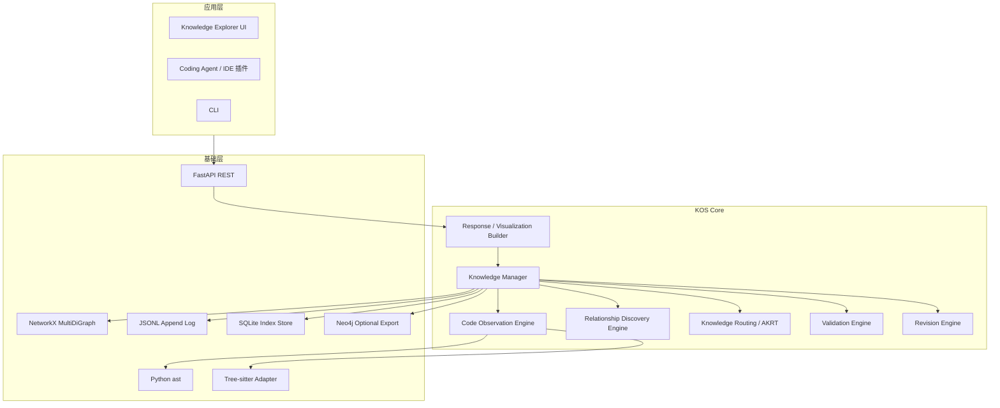
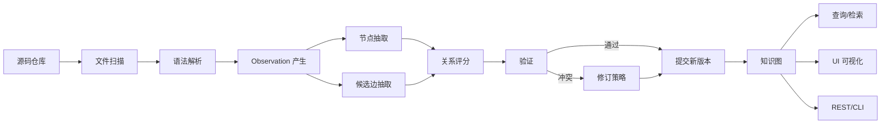
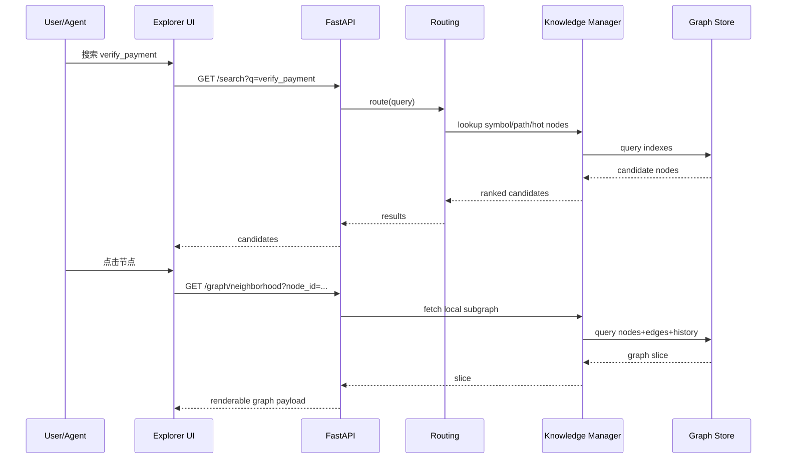
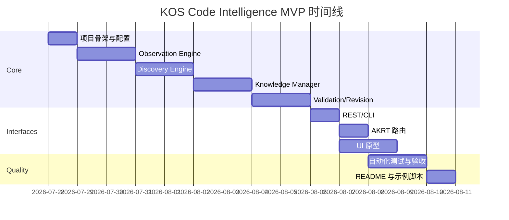

# KOS Code Intelligence MVP 技术规格与执行规范

## 执行摘要

本规范定义的 **KOS Code Intelligence MVP v0.1**，目标不是构建一个“会聊天的代码 Agent”，而是先构建一个**可增量维护、可查询、可修订的代码知识图核心**：它把工程项目中的文件、模块、类、函数、方法、导入、调用、继承与依赖关系提取为结构化节点与边，并通过版本化历史、置信度、验证与修订机制，为上层 Agent 提供稳定的结构化上下文。该方向与近年的结构化代码研究一致：代码天然具有 AST、调用图、导入图与数据流等显式结构，仅靠全文检索或反复读文件会带来高 token 成本，而持久化结构图能显著降低查询成本并改善结构性问题的回答质量。公开研究已显示，基于 Tree-sitter 与 SQLite 的持久化代码知识图可以在真实仓库上以更少 token 和更少工具调用提供接近文件探索式 Agent 的回答质量；代码属性图研究则长期证明，将 AST、控制流与依赖关系并入统一图结构，便于进行静态模式匹配、遍历与分析。citeturn8view0turn12view0turn6view8turn6view10

**默认推荐实现**如下：语言前端以 **Python `ast`** 作为 v0.1 主解析器，保证 Python MVP 的确定性与低复杂度；跨语言支持预留 **Tree-sitter** 解析适配层，用于后续 JavaScript/TypeScript/Go/Java 的统一抽取；持久化使用 **JSONL + SQLite** 双写方案，JSONL 负责可审计追加日志，SQLite 负责索引与查询；内存图默认选用 **NetworkX `MultiDiGraph`**，因为它支持有向多重边与边属性，适合同一对节点之间同时存在 `CALLS`、`IMPORTS`、`USES_TYPE` 等多种关系；图数据库后端默认不开启，但预留 **Neo4j** 导出接口，便于做深度图查询或大图可视化。上述选择都来自成熟工具链：Python `ast` 可直接暴露函数、调用与导入等语法节点；Tree-sitter 是增量解析库并支持基于 S-expression 的语法查询；NetworkX `MultiDiGraph` 支持多重边与属性；Neo4j 使用典型 property graph 模型；JSON Lines 适合逐条处理与拼接；SQLite 是嵌入式高可靠数据库，并可通过 WAL 提升并发读写，但 WAL 依赖共享内存且不适合网络文件系统。citeturn6view0turn10view0turn10view1turn10view2turn7search0turn14view3turn6view3turn11view2turn9view0turn1search1turn13view3

**本版本的边界非常明确**。它只做**静态结构理解 MVP**，优先覆盖 Python 仓库中的实体抽取、调用/继承/导入/包含关系发现、关系评分、置信度、冲突检测、修订、图查询和可视化浏览；不在 v0.1 中承诺全量数据流分析、跨仓库索引、运行时追踪、复杂类型推断、框架语义插件和自动代码修改。Tree-sitter 与 GraphCodeBERT/CodeBERT 的研究都支持这个分层策略：语法结构与数据流对代码理解很重要，但应先在稳定的结构层建立可靠“骨架”，再叠加语义模型和更重的分析能力。citeturn6view10turn6view9turn12view0

**本规范给出的交付口径是“开发可执行”而不是“概念展示”**。最终交付应包括：一个 Python 原型（目标不超过 **1000 LOC**，核心不含测试与样例数据）、一个最小样例仓库、自动化单元与集成测试、REST API、CLI、README、以及一份供代码 Agent 顺序执行的 `AGENT_EXECUTION.md`。API 层推荐使用 FastAPI，因为它基于 OpenAPI/JSON Schema，默认提供交互式文档页，便于本地调试与 Agent 调用。前端可视化推荐 **React Flow** 作为节点编辑与局部关系探索的默认 UI，重图布局与大图分析可选 **Cytoscape.js**。这两类工具都已经面向交互式节点/网络 UI 成熟使用。citeturn6view6turn9view1turn6view7turn15search0

**建议默认成功标准**如下：给定一个约 10–30 个 Python 文件的样例仓库，系统应能在一次全量索引后，正确抽取 ≥90% 的文件/类/函数节点，正确识别 ≥85% 的显式导入关系、≥80% 的直接函数调用关系、≥95% 的类继承关系；单文件改动后的增量重建 p95 < 2 秒；局部查询（如“谁调用了 `verify_payment`”）p95 < 100 ms；图 Explorer 支持节点点击展开、入边/出边过滤、版本切换和历史回放。这些阈值是工程目标，不是文献事实，但它们与 Tree-sitter 的增量解析能力、SQLite 的嵌入式部署模式以及结构化代码图在 Agent 场景中的效率优势方向一致。citeturn7search0turn13view3turn8view0

下表给出本规范的推荐默认值与开放选项。

| 维度 | 推荐默认值 | 可选项 | 说明 |
|---|---|---|---|
| 主语言 | Python | JS/TS/Go/Java | v0.1 先做 Python，跨语言通过 Tree-sitter 插件扩展 |
| 主解析器 | `ast` | `tree-sitter` | Python 用 `ast` 精度高；跨语言统一时启用 Tree-sitter |
| 图内存表示 | `networkx.MultiDiGraph` | 自定义邻接表 | 多重边最适合代码关系 |
| 持久化 | JSONL + SQLite | Neo4j | JSONL 审计，SQLite 查询，Neo4j 仅可选 |
| API 框架 | FastAPI | Flask / bare ASGI | 需要自动文档与清晰 schema |
| 图 UI | React Flow | Cytoscape.js | React Flow 做结构 Explorer，Cytoscape.js 做大图与布局 |
| 向量检索 | 可选，后期加入 | CodeBERT / GraphCodeBERT embedding | v0.1 不强依赖 embedding，但接口预留 |
| 并发模式 | 本地单机，多读单写 | 单进程 exclusive 模式 | SQLite WAL 需同机共享内存，不建议网络盘 |

## 设计边界与总体框架

本系统按三层设计。**基础层**提供解析、向量、存储和 HTTP 服务等通用能力；**KOS 核心层**负责代码知识的抽取、路由、验证和修订；**应用层**则让人类开发者、IDE 插件或上层 Agent 用统一方式查询结构信息。这样的分层与 property graph、代码属性图和近期代码知识图系统的实践一致：把结构抽取与结构查询固化为中间层，能显著降低上层工具反复扫文件的负担。citeturn11view2turn12view0turn8view0



系统的主数据流是“扫描仓库 → 产生 Observation → 抽取节点与候选边 → 验证 → 写入/修订知识图 → 提供查询与可视化”。其中 **Knowledge Manager** 必须是唯一的读写入口，避免 Observation、Revision、UI 各自绕过事务层直接写 SQLite 或 JSONL，导致版本历史断裂。SQLite 适合本地单文件索引存储；FastAPI 适合在本地快速暴露标准化 REST；Tree-sitter 适合增量重索引；而 `MultiDiGraph` 适合承载“同一对节点之间存在多种关系”的场景。citeturn1search1turn13view3turn6view6turn9view1turn6view3turn7search0



**v0.1 的范围定义**如下。必须覆盖：文件、模块、类、函数、方法、导入、直接调用、继承、包含关系、引用位置、版本与历史、局部图查询、增量重建。可以部分覆盖：类型使用、装饰器、HTTP 路由到处理函数映射、简单 side-effect 标记（如读写文件或数据库 API 的启发式标注）。明确不做：真实运行时调用图、动态 import 的完备解析、跨进程共享写、多仓库全局图、复杂数据流切片、完整框架语义（如 Django ORM 元模型）。代码属性图与近期代码知识图系统都表明，结构化表示非常有价值，但动态行为与复杂语义是更重的后续阶段。citeturn12view0turn6view8turn8view0

系统级性能目标是本规范的验收口径，而不是对底层工具文档的复述，因此以下表述为**工程目标**。

| 指标 | 目标 |
|---|---|
| 冷启动全量索引 | 10–30 文件样例仓库 < 10 秒；200 文件中型仓库 < 60 秒 |
| 单文件增量重建 | p95 < 2 秒 |
| 单点查询 | `GET /nodes/{id}` p95 < 50 ms |
| 局部邻域查询 | `GET /graph/neighborhood` p95 < 100 ms |
| 路径查询 | 2 跳内 p95 < 200 ms |
| JSONL 写入 | 单事件追加 < 10 ms |
| SQLite 提交 | 单批次 1000 事件 < 500 ms |
| UI 首屏 | 首次局部图加载 < 1 秒 |
| 内存占用 | 10k 节点 / 50k 边本地图内存 < 1 GB |

## 数据模型与核心算法

KOS 的底层数据模型采用 **property graph** 思路：节点表示实体，关系表示有向且带类型的边，节点和边都允许挂属性。Neo4j 的 property graph 文档明确支持“节点/关系/属性”的组织方式，而 NetworkX `MultiDiGraph` 则适合在内存态保留多个平行关系与边属性；这正好匹配代码世界里“`A.py` 既 `IMPORTS` `B.py`，又包含 `foo()` 调 `bar()`”的事实。citeturn11view2turn6view3

**Node Schema** 需要稳定、可版本化、可比较。推荐最小字段如下。

| 字段 | 类型 | 必填 | 说明 |
|---|---|---:|---|
| `node_id` | `string` | 是 | 全局唯一 ID，建议 `sha1(repo_relpath + kind + fqname + span)` |
| `repo_id` | `string` | 是 | 仓库 ID |
| `kind` | `enum` | 是 | `repository` / `package` / `file` / `module` / `class` / `function` / `method` / `variable` / `decorator` / `route` |
| `name` | `string` | 是 | 短名，如 `verify_payment` |
| `fqname` | `string` | 是 | 全限定名，如 `app.payment.service.verify_payment` |
| `language` | `string` | 是 | `python` |
| `file_path` | `string` | 否 | 相对仓库路径 |
| `span` | `object` | 否 | `{start_line, start_col, end_line, end_col}` |
| `signature` | `string|null` | 否 | 函数/方法签名 |
| `parent_id` | `string|null` | 否 | 所属 file/class/module |
| `labels` | `string[]` | 否 | UI 或索引标签 |
| `doc` | `string|null` | 否 | docstring/注释摘要 |
| `visibility` | `enum|null` | 否 | `public` / `protected` / `private` / `internal` |
| `hash` | `string` | 是 | 语法片段内容哈希 |
| `confidence` | `float` | 是 | 0–1 |
| `status` | `enum` | 是 | `active` / `superseded` / `deleted` / `merged` / `uncertain` |
| `version` | `int` | 是 | 当前版本号，初始为 1 |
| `created_at` | `string` | 是 | ISO-8601 |
| `updated_at` | `string` | 是 | ISO-8601 |
| `provenance` | `object[]` | 是 | 来源与证据列表 |
| `history_ref` | `string[]` | 否 | 关联历史事件 ID |

**Edge Schema** 需要支持方向、类型、评分和证据明细。Neo4j 的关系模型要求边有方向、类型和属性；这与代码关系天然一致。citeturn11view2

| 字段 | 类型 | 必填 | 说明 |
|---|---|---:|---|
| `edge_id` | `string` | 是 | 全局唯一 ID |
| `src_id` | `string` | 是 | 源节点 |
| `dst_id` | `string` | 是 | 目标节点 |
| `rel_type` | `enum` | 是 | `CONTAINS` / `DEFINES` / `IMPORTS` / `CALLS` / `MAY_CALL` / `INHERITS` / `DEPENDS_ON` / `USES_TYPE` / `DECORATES` / `READS` / `WRITES` |
| `direction` | `enum` | 是 | 固定 `out`；仅为兼容 UI/导出 |
| `confidence` | `float` | 是 | 0–1 |
| `score_breakdown` | `object` | 是 | 各评分分量 |
| `evidence` | `object[]` | 是 | AST/Tree-sitter/文本证据 |
| `provenance_weight` | `float` | 是 | 来源可信度 |
| `frequency` | `int` | 否 | 关系出现次数，如多次调用 |
| `scope` | `object` | 否 | 生效文件/模块/版本范围 |
| `status` | `enum` | 是 | `active` / `superseded` / `retracted` / `uncertain` |
| `version` | `int` | 是 | 当前版本 |
| `created_at` | `string` | 是 | ISO-8601 |
| `updated_at` | `string` | 是 | ISO-8601 |
| `history_ref` | `string[]` | 否 | 历史事件列表 |

**Versioning 与 History** 必须是事件化的，而不是“直接覆盖当前值”。JSON Lines 特别适合逐条附加事件，因为它按行存储 JSON、适合流式处理、拼接和日志化；SQLite 则适合建立最新状态视图和索引。citeturn9view0

历史事件建议统一为 `history.jsonl` 中的追加记录。格式如下：

```json
{
  "event_id": "evt_20260727_000031",
  "entity_type": "edge",
  "entity_id": "edge_2f51d14a",
  "repo_id": "sample_shop",
  "op": "supersede",
  "from_version": 1,
  "to_version": 2,
  "reason": "call target resolved from MAY_CALL to CALLS after import alias resolution",
  "actor": "revision_engine",
  "timestamp": "2026-07-27T10:42:13+09:00",
  "patch": {
    "confidence": [0.48, 0.91],
    "rel_type": ["MAY_CALL", "CALLS"]
  },
  "evidence": [
    {
      "type": "ast",
      "file_path": "app/order/service.py",
      "span": {"start_line": 33, "start_col": 8, "end_line": 33, "end_col": 29},
      "excerpt": "verify_payment(order)"
    }
  ]
}
```

下面给出一组**开发可直接实现**的样例节点与边。

```json
{
  "node_id": "node_8fa733c7",
  "repo_id": "sample_shop",
  "kind": "function",
  "name": "verify_payment",
  "fqname": "app.payment.service.verify_payment",
  "language": "python",
  "file_path": "app/payment/service.py",
  "span": {"start_line": 10, "start_col": 0, "end_line": 20, "end_col": 30},
  "signature": "verify_payment(order_id: str) -> bool",
  "parent_id": "node_file_payment_service",
  "labels": ["payment", "service"],
  "doc": "Validate payment state and gateway result.",
  "visibility": "public",
  "hash": "sha1:0f52e5f7...",
  "confidence": 0.98,
  "status": "active",
  "version": 1,
  "created_at": "2026-07-27T10:40:00+09:00",
  "updated_at": "2026-07-27T10:40:00+09:00",
  "provenance": [
    {
      "source_type": "ast",
      "parser": "python.ast",
      "file_path": "app/payment/service.py",
      "span": {"start_line": 10, "start_col": 0, "end_line": 20, "end_col": 30},
      "weight": 1.0
    }
  ],
  "history_ref": []
}
```

```json
{
  "edge_id": "edge_2f51d14a",
  "src_id": "node_order_checkout",
  "dst_id": "node_8fa733c7",
  "rel_type": "CALLS",
  "direction": "out",
  "confidence": 0.91,
  "score_breakdown": {
    "syntax": 1.0,
    "symbol_resolution": 0.9,
    "embedding": 0.55,
    "provenance": 1.0,
    "frequency": 1.0
  },
  "evidence": [
    {
      "type": "ast_call",
      "file_path": "app/order/service.py",
      "span": {"start_line": 33, "start_col": 8, "end_line": 33, "end_col": 29},
      "callee_expr": "verify_payment(order)"
    }
  ],
  "provenance_weight": 1.0,
  "frequency": 3,
  "scope": {"branch": "main", "commit": "demo-head"},
  "status": "active",
  "version": 2,
  "created_at": "2026-07-27T10:41:12+09:00",
  "updated_at": "2026-07-27T10:42:13+09:00",
  "history_ref": ["evt_20260727_000031"]
}
```

**实体抽取算法**在 v0.1 采用“双前端策略”。Python 仓库优先使用 `ast.parse()` 和 `NodeVisitor` 遍历；其原因是 `ast` 提供对 `FunctionDef`、`Call`、`Import`、`ImportFrom` 等语法节点的稳定访问，而 `NodeVisitor` 适合遍历提取而不是原地修改。Tree-sitter 则作为可选统一前端，用于支持多语言和增量刷新；其查询语言支持字段约束、缺失字段、通配符以及错误节点检索，适合编写跨语言抽取规则。citeturn6view0turn10view0turn10view1turn10view2turn10view3turn14view3turn7search0

建议的 Python 抽取流程如下：

```text
parse(file) -> Module AST
visit Module:
  emit File node
  for Import / ImportFrom:
      emit import observations
  for ClassDef:
      emit Class node
      emit CONTAINS(File, Class)
      for base in bases:
          emit candidate INHERITS(Class, Base)
  for FunctionDef / AsyncFunctionDef:
      emit Function/Method node
      emit CONTAINS(Parent, Function)
      record symbol table
      for decorator:
          emit DECORATES
      walk body:
          for Call:
              emit candidate CALLS(current_function, callee_expr)
          for Attribute/Name:
              emit usage observations
```

**关系发现**以“显式语法证据优先、语义相似度补充”为原则。其依据来自两个方向：一是代码属性图与 Tree-sitter 证明了语法结构和显式关系是代码理解的基础骨架；二是 CodeBERT 与 GraphCodeBERT 说明语义表示和数据流信息能补充结构图，但不应反过来替代显式结构。citeturn12view0turn8view0turn6view9turn6view10

推荐的静态分析启发式如下。

| 关系类型 | 一级证据 | 二级证据 | 备注 |
|---|---|---|---|
| `IMPORTS` | `ast.Import` / `ast.ImportFrom` | Tree-sitter import query | 置信度最高 |
| `INHERITS` | `ClassDef.bases` | 解析 import alias 后的基类名归一 | Python MVP 中置信度很高 |
| `CALLS` | `ast.Call(func=Name/Attribute)` | 局部符号表、import alias、同文件定义、同类方法、模块限定名 | 无法唯一解析时降级为 `MAY_CALL` |
| `DEPENDS_ON` | 文件级 import 聚合、setup/pyproject 依赖 | requirements/poetry/uv 文件解析 | v0.1 先做静态文件依赖 |
| `CONTAINS` / `DEFINES` | 文件/类/函数层级 | Tree-sitter field path | 确定性关系 |
| `DECORATES` | decorator list | 框架语义映射 | v0.1 只记录显式装饰器 |

**关系评分公式**建议如下。分值区间为 0–1，最终结果用于阈值过滤和排序，不直接替代 `confidence`。

\[
Score_{rel} = 0.40S_{syntax} + 0.20S_{resolve} + 0.15S_{prov} + 0.15S_{freq} + 0.10S_{embed}
\]

各分量定义为：

- \(S_{syntax}\)：显式语法证据，若来自直接 AST 节点则接近 1；
- \(S_{resolve}\)：符号解析成功度，唯一目标 1，多候选按歧义递减；
- \(S_{prov}\)：来源权重，`ast` > `tree-sitter` > regex fallback > embedding guess；
- \(S_{freq}\)：出现频率归一后分数；
- \(S_{embed}\)：可选语义相似度，只在需要补全候选时使用。

推荐默认来源权重：

| 来源 | `S_prov` |
|---|---:|
| Python `ast` 直接节点 | 1.00 |
| Tree-sitter 精确 query | 0.90 |
| import/alias 解析后推断 | 0.80 |
| 规则/命名约定推断 | 0.60 |
| embedding 候选补全 | 0.35 |

**Confidence 模型**与 `Score_rel` 不同：前者表示“当前知识被系统接受的稳定程度”，后者表示“一次发现事件的候选强度”。建议采用增量可更新公式：

\[
Confidence_{t+1} = clip\Big(
0, 1,\;
0.55C_t +
0.20E_t +
0.10P_t +
0.10F_t -
0.20X_t -
0.10A_t
\Big)
\]

其中：

- \(C_t\)：当前置信度；
- \(E_t\)：显式证据强度；
- \(P_t\)：来源可信度；
- \(F_t\)：重复观测频率；
- \(X_t\)：冲突强度；
- \(A_t\)：歧义惩罚。

直观上，这个模型让显式语法证据和重复验证稳步提升置信度，而冲突和歧义显著下调置信度。对于节点，例如函数定义，`ast` 直接观测大多会趋近 1；对于边，例如复杂的 `Attribute` 调用解析，置信度可先落在 0.45–0.80，再等待后续验证提升。

**冲突检测规则**必须面向代码世界重新定义。这里的“冲突”不是自然语言中的真伪冲突，而是**结构知识之间的不一致**。规则如下：

| 冲突类型 | 触发条件 | 处理 |
|---|---|---|
| 目标漂移冲突 | 同一调用位点在新版本从 `CALLS A` 变成 `CALLS B` | 新增版本，旧边 `superseded` |
| 继承冲突 | 同一类基类从 `Base1` 变成 `Base2` | 新增版本，记录 `reason=refactor` |
| 导入冲突 | 同一符号解析目标改变 | 降低旧边置信度并写新边 |
| 删除冲突 | 节点不再存在于新解析结果 | `status=deleted`，不物理删除 |
| 歧义冲突 | 原 `CALLS` 无法再唯一定位 | 回退为 `MAY_CALL` 或作用域收窄 |
| 聚合规则冲突 | 例如“模块 A 依赖模块 B”被拆分为多文件依赖 | 作用域收窄到文件级，保留模块级历史 |

**修订策略**按四类执行，这与 KOS 的历史理念一致，但映射到代码结构场景。  
其一，**置信度更新**：重复观察到同一边，提升 `confidence`。  
其二，**作用域收窄**：原本在模块级成立的关系，发现只在类或文件级成立，则收窄 `scope`。  
其三，**例外插入**：针对聚合规则，例如“`app.payment.*` 普遍依赖 `gateway`”，若个别文件改走 mock/stub，则在聚合层加入 exception 列表，而不是直接抹除规则。  
其四，**版本切换**：任何影响实体身份或边目标的变化，都新增版本并写入 `history.jsonl`。  

**AKRT 路由与索引** 是本规范对“知识哈夫曼式导航”思想的落地版本，但它不是哈夫曼树，而是**自适应知识路由树**。哈夫曼优化的是频率加权路径长度；AKRT 在这里借用“高频热点靠近入口”的思想，用于降低局部查询成本，而底层真实数据结构仍是图。代码图天然具有树与网的混合特征：文件系统是树，调用/继承/依赖是图。Neo4j 文档也明确指出，关系可以组织成树、列表、映射或任意更复杂结构。citeturn11view1turn11view2

AKRT 建议结构如下：

```text
root(repo)
 ├─ package
 │   ├─ file
 │   │   ├─ class
 │   │   │   └─ method
 │   │   └─ function
 │   └─ hot_symbols
 ├─ dependency_index
 ├─ call_hub_index
 └─ name_trigram_index
```

AKRT 的检索分数建议为：

\[
Score_{route} = 0.35S_{path} + 0.25S_{symbol} + 0.20S_{type} + 0.10S_{freq} + 0.10S_{graph}
\]

- \(S_{path}\)：包路径前缀命中；
- \(S_{symbol}\)：符号名精确/模糊命中；
- \(S_{type}\)：实体类型命中，如“找函数”；
- \(S_{freq}\)：热点访问提升；
- \(S_{graph}\)：图中心性或局部连通度加权。

AKRT 的目的不是替代图查询，而是**把起点选对**。在 10k 节点以上时，这能显著减少“从全图盲搜”的成本。

## 模块契约

下面的模块规范面向“写代码的 Agent 或工程师”，因此每个模块都按 **输入、输出、职责、禁止行为、接口、工作流伪代码、测试用例** 给出。

**Code Observation Engine**

| 项目 | 规格 |
|---|---|
| 输入 | 仓库根目录、文件改动事件、单文件路径、文件内容字符串 |
| 输出 | `Observation[]`，包括文件发现、AST 片段、语法错误、符号候选、哈希 |
| 职责 | 扫描文件、过滤语言、解析 AST/Tree-sitter、计算内容哈希、生成 Observation，不直接写图 |
| 禁止行为 | 不直接创建最终节点/边；不直接写 SQLite/JSONL；不做修订决策 |
| 接口 | REST: `POST /observe/repo`, `POST /observe/file`; CLI: `kos observe`; SDK: `observe_repo()`, `observe_file()` |

伪代码：

```python
def observe_file(path: str) -> list[Observation]:
    text = read_text(path)
    file_hash = sha1(text)
    if is_python(path):
        tree = ast.parse(text)
        return emit_python_observations(path, file_hash, tree)
    elif tree_sitter_enabled():
        cst = ts_parse(path, text)
        return emit_ts_observations(path, file_hash, cst)
    else:
        return [Observation(type="unsupported_file", file_path=path, hash=file_hash)]
```

单元测试：

- 给定 `class A: pass`，应产出 `file_discovered` 与 `class_candidate`。
- 给定语法错误文件，应产出 `parse_error` Observation，而不是抛出未处理异常。
- 同一文件内容不变再次扫描，`file_hash` 必须一致。

集成测试：

- 扫描样例仓库后，Observation 数量应与文件数、类数、函数数大致一致。
- 单文件变更时，只重发该文件 Observation，不重复全仓库全量 Observation。

错误案例：

- UTF-8 解码失败：返回 `observation_error`，不终止整个扫描批次。
- AST 解析失败：写 `syntax_error` Observation，允许后续 UI 标红展示。
- 文件被删除：发出 `file_deleted` Observation。

**Relationship Discovery Engine**

| 项目 | 规格 |
|---|---|
| 输入 | `Observation[]`、符号表缓存、现有局部图 |
| 输出 | `CandidateNode[]`、`CandidateEdge[]` |
| 职责 | 抽取节点、发现候选边、计算 `Score_rel`、标注候选来源与证据 |
| 禁止行为 | 不直接决定“最终真值”；不改写已有版本 |
| 接口 | REST: `POST /discover`; CLI: `kos discover`; SDK: `discover_relationships()` |

伪代码：

```python
def discover_relationships(observations, symbol_index):
    nodes, edges = [], []
    for obs in observations:
        if obs.type == "function_def":
            nodes.append(build_function_node(obs))
        elif obs.type == "class_def":
            nodes.append(build_class_node(obs))
            for base in obs.bases:
                edges.append(candidate_inherits(obs, base, symbol_index))
        elif obs.type == "call_site":
            edges.extend(resolve_call_candidates(obs, symbol_index))
        elif obs.type in ("import", "import_from"):
            edges.extend(resolve_import_candidates(obs, symbol_index))
    return score_candidates(nodes, edges)
```

单元测试：

- `from x import y` 应产生 `IMPORTS(file, x)` 和 `DEFINES/USES` 候选。
- `class Admin(User)` 应产生 `INHERITS(Admin, User)`。
- `foo()` 命中同文件定义时应优先解析到本地函数。

集成测试：

- 对样例仓库生成的 `CALLS` 候选中，直接调用解析正确率应达到目标阈值。
- alias import 改名后，解析应跟随新 alias 而变化。

错误案例：

- 多个同名候选：输出多个 `MAY_CALL` 候选，等待 Validation 决策。
- 动态调用 `getattr(x, name)()`：仅输出 `MAY_CALL` 或 `dynamic_call` 观察，不伪造确定边。

**Knowledge Manager**

| 项目 | 规格 |
|---|---|
| 输入 | 已验证节点/边、修订事件、查询请求 |
| 输出 | 最新图视图、版本历史、持久化结果 |
| 职责 | 提供唯一读写入口；同步 JSONL、SQLite、内存图；维护版本、状态、事务 |
| 禁止行为 | 不自行进行关系推断；不直接解析源码 |
| 接口 | REST: `/nodes/*`, `/edges/*`, `/history/*`; CLI: `kos graph`, `kos history`; SDK: `upsert_node()`, `upsert_edge()`, `append_history()` |

推荐存储布局如下。JSON Lines 负责 append-only 事件，SQLite 负责当前状态与索引视图；这种“日志 + 索引”模式兼顾可审计和查询效率。JSONL 的逐行 JSON 特性与 SQLite 的嵌入式单文件数据库特性都很适合本地 Agent 工具。citeturn9view0turn1search1

```text
.kos/
  config.yaml
  graph.db
  logs/
    observations.jsonl
    history.jsonl
    errors.jsonl
  snapshots/
    latest_nodes.jsonl
    latest_edges.jsonl
  cache/
    akrt.json
    embeddings.sqlite
    symbol_index.json
```

SQLite 建议表：

- `nodes_current`
- `edges_current`
- `history_events`
- `symbols`
- `akrt_paths`
- `query_cache`

WAL 建议仅在**本机单仓库本地运行**开启，因为 SQLite WAL 需要共享内存且不适合网络文件系统。citeturn13view3

伪代码：

```python
def commit_batch(nodes, edges, history_events):
    with sqlite_txn():
        write_jsonl("logs/history.jsonl", history_events)
        upsert_nodes_current(nodes)
        upsert_edges_current(edges)
        refresh_symbol_index(nodes, edges)
        refresh_akrt(nodes)
    sync_networkx_view(nodes, edges)
```

单元测试：

- 同一 `node_id` 新版本写入后，`nodes_current.version` 必须更新，旧版本留在历史中。
- 批量提交中任何一条违反约束，整个事务回滚。
- JSONL 与 SQLite 中的 entity 计数应一致。

集成测试：

- 全量索引后重启服务，SQLite 与 JSONL 重放结果应一致。
- 执行一次修订后，UI/API 能看到新版本，旧版本仍可通过 history 访问。

错误案例：

- SQLite 锁冲突：返回可重试错误码与退避建议。
- JSONL 磁盘写失败：本批次整体失败，不允许只更新 SQLite。

**Knowledge Routing / Indexing**

| 项目 | 规格 |
|---|---|
| 输入 | 当前图、符号表、查询字符串、实体类型过滤 |
| 输出 | 节点候选、起始子图、路径建议 |
| 职责 | 通过 AKRT、符号名索引、路径前缀、类型过滤和局部图度量缩小检索范围 |
| 禁止行为 | 不修改图；不输出未经存在验证的实体 |
| 接口 | REST: `GET /search`, `GET /route`; CLI: `kos search`; SDK: `search_graph()` |

伪代码：

```python
def route(query, node_type=None):
    c1 = lookup_exact_symbol(query)
    c2 = lookup_fuzzy_symbol(query)
    c3 = lookup_path_prefix(query)
    merged = merge_rank(c1, c2, c3, node_type=node_type)
    seeds = rerank_with_akrt(merged)
    return expand_local_neighborhood(seeds[:10], hops=1)
```

单元测试：

- 查询 `verify_payment` 时，应先返回符号精确命中，再返回模糊命中。
- 查询 `app.payment` 时，优先命中包路径。
- 高频热点节点应在同名模糊集合中更靠前。

集成测试：

- 对 10k 节点图，路径前缀查询 p95 达到目标。
- UI 点击包节点时，返回局部子图而非全图。

错误案例：

- 无命中：返回空结果，不报 500。
- 命中太多：截断并返回 `truncated=true`。

**Validation Engine**

| 项目 | 规格 |
|---|---|
| 输入 | `CandidateNode[]`、`CandidateEdge[]`、当前图、历史版本 |
| 输出 | `ValidatedNode[]`、`ValidatedEdge[]`、`Conflict[]` |
| 职责 | 去重、实体身份比对、候选阈值筛选、冲突判定、状态迁移建议 |
| 禁止行为 | 不直接写数据库；不丢弃历史 |
| 接口 | REST: `POST /validate`; CLI: `kos validate`; SDK: `validate_candidates()` |

伪代码：

```python
def validate_candidates(candidates, graph):
    validated, conflicts = [], []
    for c in candidates:
        existing = find_same_identity(c, graph)
        if not existing and c.confidence >= MIN_ACCEPT:
            validated.append(as_new(c))
        elif existing and is_same_fact(c, existing):
            validated.append(as_reconfirmed(c, existing))
        elif existing and conflicts_with(c, existing):
            conflicts.append(build_conflict(c, existing))
        else:
            validated.append(as_uncertain(c))
    return validated, conflicts
```

单元测试：

- 同一函数定义重复扫描不应产生新节点，只应 reconfirm。
- 同一调用位点改变目标，应输出 conflict。
- 低于最低阈值的 embedding-only 候选不应直接通过。

集成测试：

- 对重构前后两个版本，Validation 应能识别“实体没变、边变了”。
- 对删除文件，相关节点应进入 `deleted` 或 `superseded` 状态，而非直接消失。

错误案例：

- 身份哈希碰撞：退回到 `fqname + file_path + span` 复核。
- 图不一致：返回校验失败，并阻止 Revision 继续。

**Revision Engine**

| 项目 | 规格 |
|---|---|
| 输入 | `Conflict[]`、`Validated*`、当前图 |
| 输出 | `RevisionPlan`、新版本节点/边、历史事件 |
| 职责 | 决定 confidence 更新、作用域收窄、例外插入、版本切换、状态迁移 |
| 禁止行为 | 不静默覆盖旧版本；不物理删除历史 |
| 接口 | REST: `POST /revise`; CLI: `kos revise`; SDK: `revise_graph()` |

伪代码：

```python
def revise(conflicts):
    revisions = []
    for conflict in conflicts:
        if conflict.kind == "target_drift":
            revisions += supersede_edge(conflict.old, conflict.new)
        elif conflict.kind == "scope_overgeneralized":
            revisions += narrow_scope(conflict.entity, conflict.scope)
        elif conflict.kind == "ambiguity_increased":
            revisions += downgrade_to_may_call(conflict.entity)
        elif conflict.kind == "deleted_symbol":
            revisions += mark_deleted(conflict.entity)
    return revisions
```

单元测试：

- `CALLS -> MAY_CALL` 降级应保留原版本历史。
- 删除节点应仅改 `status`，不能物理删除。
- 新版本创建后 `version = old + 1`。

集成测试：

- 代码重构（改函数名、改基类、改导入）能生成完整历史链。
- UI 历史视图中能看到前后版本差异。

错误案例：

- conflict plan 不可执行：事务终止。
- 同一实体多策略同时命中：按优先级执行 `versioning > scope narrowing > confidence update`。

**Response / Visualization Builder**

| 项目 | 规格 |
|---|---|
| 输入 | 节点/边/历史查询结果 |
| 输出 | REST JSON、CLI 文本、UI 图数据 |
| 职责 | 将图数据转换成对人类和 Agent 可用的响应结构，不改写底层图 |
| 禁止行为 | 不做新的关系发现；不写版本 |
| 接口 | REST: `GET /graph/*`, `GET /explain/*`; CLI: `kos explain`; SDK: `build_response()` |

伪代码：

```python
def build_node_detail(node_id):
    node = km.get_node(node_id)
    in_edges = km.get_in_edges(node_id)
    out_edges = km.get_out_edges(node_id)
    history = km.get_history(node_id)
    return {
        "node": node,
        "neighbors": summarize_neighbors(in_edges, out_edges),
        "history": history,
        "narrative": render_explanation(node, in_edges, out_edges)
    }
```

单元测试：

- 节点详情必须包含基础属性、邻域摘要、历史链。
- `explain_path(A, B)` 返回的路径应与图查询一致。
- 空节点 ID 返回 404，不返回空 200。

集成测试：

- Explorer 点击节点时，前端拿到的数据足以渲染局部图。
- CLI `kos explain verify_payment` 与 REST 返回的核心实体一致。

错误案例：

- 局部子图过大：自动截断并返回 `partial=true`。

**Knowledge Explorer UI**

| 项目 | 规格 |
|---|---|
| 输入 | 图 REST 数据流 |
| 输出 | 交互式节点图、侧边详情、历史时间轴、搜索面板 |
| 职责 | 提供节点展开、边过滤、历史切换、路径查看、局部重排与错误可视化 |
| 禁止行为 | 不直接写底层图；所有修改走 API |
| 接口 | Web UI；前后端通信走 REST；本地开发可使用 React Flow，复杂大图可选 Cytoscape.js |

React Flow 面向节点式交互图，Cytoscape.js 面向交互式网络图分析，两者都适合 Knowledge Explorer，但侧重点不同：React Flow 更适合作为“局部结构阅读器”，Cytoscape.js 更适合做大图布局和分析。citeturn6view7turn15search0

UI 行为要求：

- 点击节点：展开一跳入边/出边并在右侧显示详情；
- 点击边：显示关系类型、评分拆解、证据摘录与版本历史；
- 顶部搜索：走 AKRT 路由；
- 历史时间轴：比较实体各版本；
- 过滤器：按 `CALLS`、`IMPORTS`、`INHERITS` 等筛选；
- 语法错误节点：红色高亮，支持跳转文件范围。

单元测试：

- 节点点击后至少触发一次 `GET /graph/neighborhood`。
- 筛选 `CALLS` 后只显示调用边。
- 切换版本后边颜色与状态更新正确。

集成测试：

- 从搜索到详情到历史回放的主流程无 500。
- 50–200 节点局部图中，拖拽与缩放不卡顿。

## 存储、API、CLI 与界面规范

本节给出**工程实施级**的目录布局、接口契约和交互样例。默认采用 “**JSONL 事件日志 + SQLite 当前状态 + NetworkX 内存图**” 三层存储：JSONL 便于审计与重放，SQLite 便于索引和事务，NetworkX 便于本地路由与路径查询；当需要大图持久查询时，可选导出到 Neo4j property graph。citeturn9view0turn6view3turn11view2

建议文件布局如下：

```text
repo_root/
  .kos/
    config.yaml
    graph.db
    logs/
      observations.jsonl
      history.jsonl
      errors.jsonl
    snapshots/
      latest_nodes.jsonl
      latest_edges.jsonl
    cache/
      akrt.json
      symbol_index.json
      query_cache.sqlite
  app/
    ...
  tests/
    ...
```

`config.yaml` 推荐项：

```yaml
repo_id: sample_shop
language: python
storage:
  sqlite_path: .kos/graph.db
  jsonl_dir: .kos/logs
  wal: true
graph:
  backend: networkx
  optional_export: neo4j
routing:
  akrt_enabled: true
  hot_node_decay_half_life_hours: 72
validation:
  min_accept_confidence: 0.65
  may_call_threshold: 0.40
api:
  host: 127.0.0.1
  port: 8031
parsers:
  python_ast: true
  tree_sitter: false
```

**REST API** 推荐使用 FastAPI。其基于 OpenAPI/JSON Schema，并默认生成交互式文档页，适合作为开发与 Agent 执行接口。citeturn6view6turn9view1

| 方法 | 路径 | 说明 |
|---|---|---|
| `POST` | `/index/repo` | 全量索引仓库 |
| `POST` | `/index/file` | 增量索引单文件 |
| `GET` | `/nodes/{node_id}` | 取节点详情 |
| `GET` | `/edges/{edge_id}` | 取边详情 |
| `GET` | `/history/{entity_id}` | 取实体历史 |
| `GET` | `/search` | AKRT 搜索 |
| `GET` | `/graph/neighborhood` | 取局部邻域 |
| `GET` | `/graph/path` | 取路径 |
| `POST` | `/observe/repo` | 仅观测，不提交 |
| `POST` | `/discover` | 从 Observation 生成候选 |
| `POST` | `/validate` | 验证候选 |
| `POST` | `/revise` | 执行修订 |
| `GET` | `/healthz` | 健康检查 |
| `GET` | `/metrics` | 基础性能指标 |

示例：全量索引请求

```json
POST /index/repo
{
  "repo_path": "/workspace/sample_shop",
  "mode": "full",
  "language": "python",
  "tree_sitter": false
}
```

示例：全量索引响应

```json
{
  "repo_id": "sample_shop",
  "run_id": "run_20260727_0001",
  "status": "ok",
  "files_scanned": 18,
  "nodes_created": 94,
  "edges_created": 173,
  "conflicts": 3,
  "duration_ms": 2841
}
```

示例：邻域查询请求

```json
GET /graph/neighborhood?node_id=node_8fa733c7&hops=1&edge_types=CALLS,IMPORTS,INHERITS
```

示例：邻域查询响应

```json
{
  "center": "node_8fa733c7",
  "nodes": [
    {"id": "node_8fa733c7", "label": "verify_payment", "kind": "function"},
    {"id": "node_order_checkout", "label": "checkout", "kind": "function"},
    {"id": "node_payment_service_file", "label": "service.py", "kind": "file"}
  ],
  "edges": [
    {"id": "edge_2f51d14a", "source": "node_order_checkout", "target": "node_8fa733c7", "type": "CALLS"},
    {"id": "edge_contains_01", "source": "node_payment_service_file", "target": "node_8fa733c7", "type": "CONTAINS"}
  ],
  "partial": false
}
```

**CLI 契约** 面向 Agent 执行应保持单命令单职责。推荐如下：

| 命令 | 作用 |
|---|---|
| `kos init` | 初始化 `.kos/` 目录与配置 |
| `kos index --repo .` | 全量索引 |
| `kos index-file app/payment/service.py` | 增量索引单文件 |
| `kos search verify_payment` | 符号/路径搜索 |
| `kos show node <node_id>` | 显示节点详情 |
| `kos show edge <edge_id>` | 显示边详情 |
| `kos history <entity_id>` | 显示历史 |
| `kos path <src> <dst>` | 求路径 |
| `kos export --format jsonl` | 导出最新快照 |
| `kos export --format neo4j` | 导出 property graph |
| `kos serve` | 启动 REST API |
| `kos doctor` | 执行自检 |

**Knowledge Explorer 交互式图形 mockup** 建议如下。这里不是最终视觉稿，而是开发必须满足的结构布局。

```text
┌────────────────────────────────────────────────────────────────────┐
│ Search: [ verify_payment                         ]  Filters [CALLS▼] │
├───────────────────────────────┬────────────────────────────────────┤
│ Graph Canvas                  │ Detail Panel                       │
│                               │                                    │
│  checkout ──CALLS──> verify   │ Name: verify_payment               │
│      │                        │ Kind: function                     │
│      └─IMPORTS─> service.py   │ FQName: app.payment.service...     │
│                               │ File: app/payment/service.py       │
│  UserService ─INHERITS─> Base │ Confidence: 0.98                   │
│                               │ Version: 1                         │
│ [Expand In] [Expand Out]      │ Evidence: ast FunctionDef          │
│ [Show Path] [Show History]    │ History: [v1]                      │
├───────────────────────────────┴────────────────────────────────────┤
│ Timeline / History: v1 ────────────────●────────────── v2           │
└────────────────────────────────────────────────────────────────────┘
```

React Flow 适合作为该 UI 的默认框架，因为它本身就是可定制节点式交互组件；若需要大图布局、图算法或浏览器端图分析，Cytoscape.js 更适合作为第二阶段增强。citeturn6view7turn15search0

下面给出一个用于前后端对接的交互时序图。



## MVP 开发计划、测试矩阵与交付

本 MVP 的核心目标是：**在一个最小 Python 工程仓库上，构建可查询、可修订、可回放历史的代码知识图，并通过 REST/CLI/UI 展示它。** 这比“直接做一个通用代码 Agent”更合理，因为它先把最贵、最容易失控的“结构理解层”稳定下来。代码图、静态分析和结构化代码检索的相关研究都表明，结构层独立出来后，后续无论接 LLM Agent、IDE 还是分析工具，都更容易扩展。citeturn12view0turn8view0

**样例最小数据集**建议为一个 15–20 文件的 Python 小仓库 `sample_shop`，包含以下结构：

```text
sample_shop/
  app/
    main.py
    auth/
      service.py
      repository.py
    order/
      service.py
      models.py
    payment/
      service.py
      gateway.py
      adapters.py
    shared/
      base.py
      db.py
  tests/
    test_order.py
    test_payment.py
```

这个仓库至少要覆盖以下场景：

- `class AdminService(BaseService)`：继承关系；
- `checkout()` 调 `verify_payment()`：显式函数调用；
- `from app.payment.service import verify_payment`：导入关系；
- `PaymentGateway` 与 `MockGateway`：同名接口/实现式关系（可先仅建类节点）；
- 一次重构提交：把 `verify_payment` 挪到 `gateway.py` 或改名，触发边修订；
- 一个语法错误文件：测试解析错误处理；
- 一个动态调用样例：测试降级为 `MAY_CALL`。

**开发任务优先级**建议如下。

| 优先级 | 任务 | 估算人日 | 验收标准 |
|---|---|---:|---|
| P0 | 项目骨架、配置、目录结构 | 0.5 | `kos init` 可创建 `.kos/` |
| P0 | Python AST Observation Engine | 1.5 | 可抽取文件/类/函数/导入/调用 Observation |
| P0 | Node/Edge Schema 与 Pydantic 模型 | 1.0 | 统一序列化与校验通过 |
| P0 | Relationship Discovery | 2.0 | 直接调用/继承/导入识别通过样例测试 |
| P0 | Knowledge Manager(JSONL + SQLite) | 2.0 | 可持久化、可重启恢复 |
| P0 | Validation + Revision | 1.5 | 支持 reconfirm / supersede / deleted |
| P0 | REST API | 1.0 | `/index/repo`, `/search`, `/nodes/{id}` 可用 |
| P1 | AKRT 路由与符号搜索 | 1.0 | 搜索排序合理，精确命中优先 |
| P1 | Response Builder | 0.5 | 节点详情与局部图 JSON 可返回 |
| P1 | CLI | 0.5 | `index/search/show/history/serve` 可用 |
| P1 | Explorer UI 原型 | 2.0 | 节点点击、局部展开、历史切换可用 |
| P1 | 自动化单元与集成测试 | 1.5 | 覆盖率建议 > 75% |
| P2 | Neo4j 导出器 | 0.5 | 可导出 property graph CSV/JSON |
| P2 | Tree-sitter 适配层骨架 | 1.0 | 能接入但默认关闭 |

合计建议工作量约 **14–15 人日**。如果用代码 Agent 辅助写样板和测试，人工工作可以主要集中在 schema、评分、修订规则和验收上。

**验收测试矩阵**建议如下。

| 测试名 | 输入 | 期望输出 |
|---|---|---|
| 定义抽取 | 单文件含 class/function/import | 生成正确节点与 `CONTAINS` 边 |
| 导入识别 | `from x import y` | 识别 `IMPORTS(file, x)` |
| 调用识别 | `checkout -> verify_payment` | 生成 `CALLS` 高置信边 |
| 继承识别 | `class A(B)` | 生成 `INHERITS(A, B)` |
| 别名解析 | `import service as ps` | 解析到真实模块 |
| 冲突修订 | 调用目标改名/迁移 | 旧边 superseded，新边 active |
| 删除处理 | 删除文件 | 原节点标记 deleted |
| 语法错误 | 错误 Python 文件 | 生成 parse error，不崩溃 |
| 搜索路由 | 搜 `verify_payment` | 精确符号排名第一 |
| UI 邻域 | 点击函数节点 | 返回局部一跳图与详情 |

**可交付物**必须明确且最小化：

| 交付物 | 说明 |
|---|---|
| `src/` | 可运行 Python 原型，目标核心代码 ≤1000 LOC |
| `sample_data/sample_shop/` | 最小样例仓库 |
| `tests/` | 单元测试 + 集成测试 |
| `README.md` | 设计、运行、API、限制说明 |
| `AGENT_EXECUTION.md` | 供代码 Agent 顺序执行的实现脚本 |
| `.kos/` 生成样例 | 演示数据与图快照 |
| 可选 `ui/` | Explorer 原型 |

开发时间线建议如下：



最后给出一份**可直接交给代码 Agent 执行**的 `AGENT_EXECUTION.md` 内容草案。它不是伪愿景，而是操作脚本。

```markdown
# AGENT_EXECUTION.md

## 目标
实现 KOS Code Intelligence MVP v0.1 的 Python 原型，面向 Python 仓库，支持：
- Observation
- Node/Edge 发现
- JSONL + SQLite 持久化
- Validation / Revision
- REST API
- CLI
- 最小 UI 原型
- 自动化测试

## 环境
1. 创建 Python 3.12+ 虚拟环境
2. 安装依赖：
   - fastapi
   - uvicorn
   - pydantic
   - networkx
   - pytest
   - httpx
   - typer
   - sqlalchemy 或 sqlite3（优先 stdlib）
   - optional: tree-sitter, reactflow 前端依赖

## 执行步骤

### 第一步
创建目录：
- src/kos/
- tests/
- sample_data/sample_shop/
- .kos/ 初始化脚本

### 第二步
实现 `schemas.py`
- NodeModel
- EdgeModel
- ObservationModel
- HistoryEventModel
- ConfigModel

### 第三步
实现 `observation.py`
- observe_repo(repo_path)
- observe_file(file_path)
- 使用 Python ast 提取：
  - File
  - Import / ImportFrom
  - ClassDef
  - FunctionDef / AsyncFunctionDef
  - Call

### 第四步
实现 `discovery.py`
- build nodes
- build candidate edges
- resolve imports
- resolve inheritance
- resolve direct calls
- unresolved calls -> MAY_CALL

### 第五步
实现 `storage.py`
- append_jsonl(path, obj)
- sqlite init
- upsert nodes_current
- upsert edges_current
- append history_events
- load latest graph into NetworkX MultiDiGraph

### 第六步
实现 `validation.py`
- find_same_identity
- is_same_fact
- conflicts_with
- validate_candidates

### 第七步
实现 `revision.py`
- confidence_update
- supersede_edge
- narrow_scope
- mark_deleted
- downgrade_to_may_call

### 第八步
实现 `routing.py`
- exact symbol search
- fuzzy symbol search
- path prefix ranking
- AKRT cache build

### 第九步
实现 `api.py`
路由：
- POST /index/repo
- POST /index/file
- GET /search
- GET /nodes/{node_id}
- GET /edges/{edge_id}
- GET /graph/neighborhood
- GET /history/{entity_id}
- GET /healthz

### 第十步
实现 `cli.py`
命令：
- kos init
- kos index --repo .
- kos search SYMBOL
- kos show node NODE_ID
- kos history ENTITY_ID
- kos serve

### 第十一步
创建样例仓库 `sample_shop`
要求包含：
- import
- inheritance
- direct call
- rename/refactor 场景
- syntax error fixture

### 第十二步
编写测试
单元测试：
- test_observation.py
- test_discovery.py
- test_storage.py
- test_validation.py
- test_revision.py
- test_routing.py

集成测试：
- test_index_repo.py
- test_refactor_revision.py
- test_api_endpoints.py

### 第十三步
运行 Demo
1. `kos init`
2. `kos index --repo sample_data/sample_shop`
3. `kos search verify_payment`
4. `kos serve`
5. 打开 `/docs`
6. 调用 `/graph/neighborhood`

### 第十四步
输出 README
README 必须包含：
- 架构图
- 文件结构
- API 示例
- CLI 示例
- 已知限制
- 下一阶段计划

## 完成标准
- 全量索引成功
- 样例仓库可查询
- 重构后历史可回放
- 测试通过
- API 文档可打开
```

如果严格按上面的契约实施，**v0.1 的成品应该不是“大而全 Agent”**，而是一个稳定、可调试、可回放的**代码知识图核心**。这一步完成后，后续无论接入 LLM Agent、IDE、代码问答还是影响分析，都将建立在稳定的结构层之上；这也是代码属性图、结构化代码检索和近期代码知识图系统反复验证过的方向。citeturn12view0turn8view0turn6view8